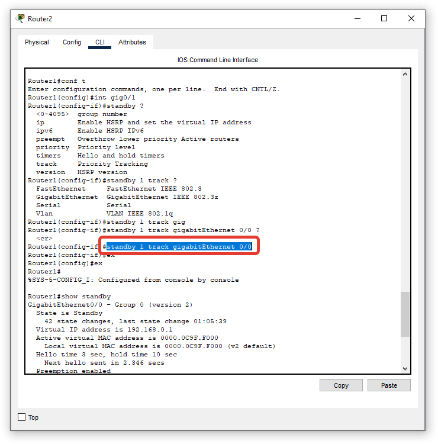
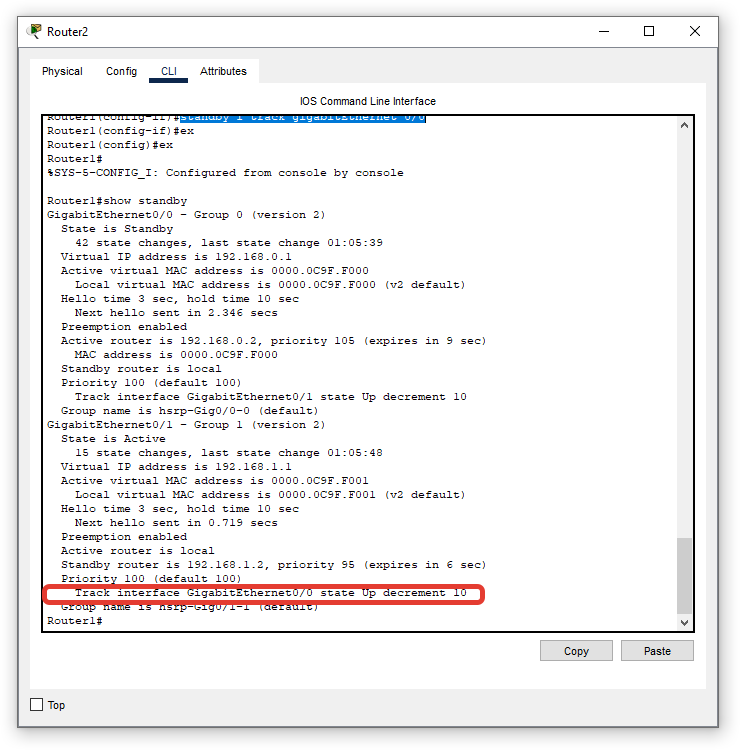
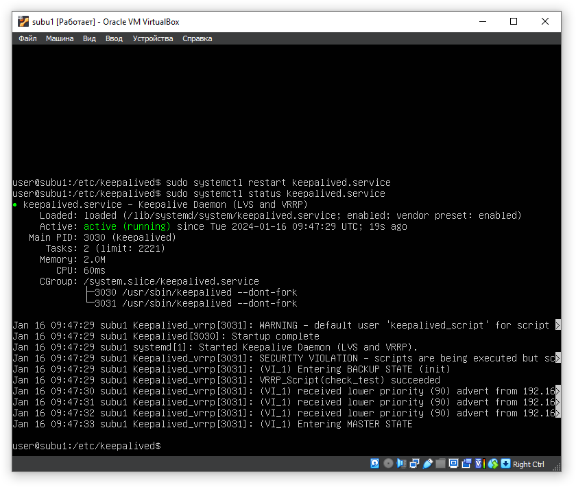
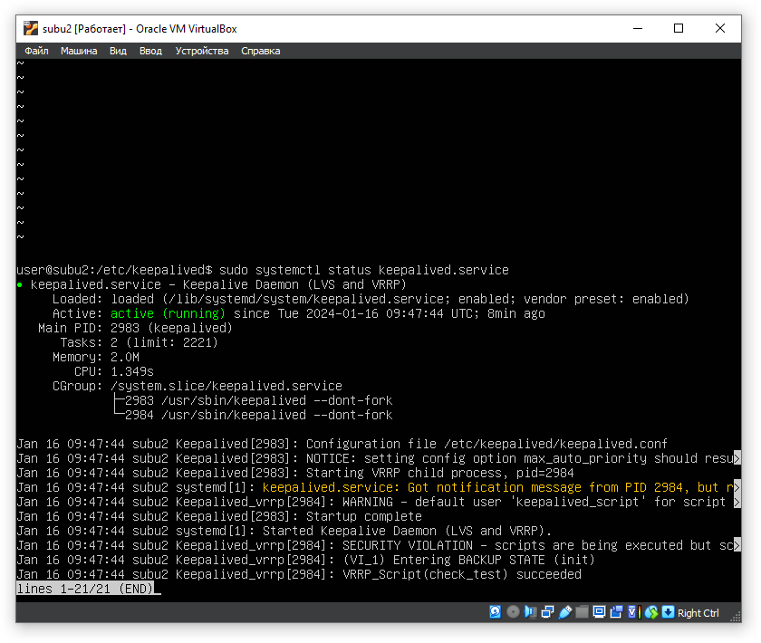
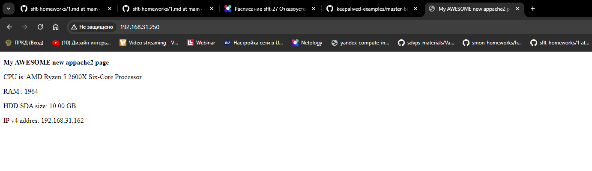
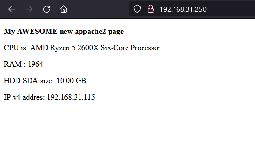

# Disaster_recovery_Keepalived

### Задание 1
- Дана [схема](1/hsrp_advanced.pkt) для Cisco Packet Tracer, рассматриваемая в лекции.
- На данной схеме уже настроено отслеживание интерфейсов маршрутизаторов Gi0/1 (для нулевой группы)
- Необходимо аналогично настроить отслеживание состояния интерфейсов Gi0/0 (для первой группы).
- Для проверки корректности настройки, разорвите один из кабелей между одним из маршрутизаторов и Switch0 и запустите ping между PC0 и Server0.
- На проверку отправьте получившуюся схему в формате pkt и скриншот, где виден процесс настройки маршрутизатора.

### Решение 1
Вся суть решения сводится к прописыванию отслеживания интерфейса gig0/0 на обоих маршрутизаторах для первой группы командой Router0(config-if)#standby 1 track gigabitEthernet 0/0

Тогда при разрыве линков на этом интерфейсе меняются приоритеты в группе 1. Так же был изменен приоритет на роутере 1 в группе 1 интерфейс gig 0/1 с 50 на 95

Рабочая схема [здесь](hsrp_cpt/hsrp_done.pkt)

Настройка интерфейса:

Скрин 1

Скрин 2

------

### Задание 2
- Запустите две виртуальные машины Linux, установите и настройте сервис Keepalived как в лекции, используя пример конфигурационного [файла](1/keepalived-simple.conf).
- Настройте любой веб-сервер (например, nginx или simple python server) на двух виртуальных машинах
- Напишите Bash-скрипт, который будет проверять доступность порта данного веб-сервера и существование файла index.html в root-директории данного веб-сервера.
- Настройте Keepalived так, чтобы он запускал данный скрипт каждые 3 секунды и переносил виртуальный IP на другой сервер, если bash-скрипт завершался с кодом, отличным от нуля (то есть порт веб-сервера был недоступен или отсутствовал index.html). Используйте для этого секцию vrrp_script
- На проверку отправьте получившейся bash-скрипт и конфигурационный файл keepalived, а также скриншот с демонстрацией переезда плавающего ip на другой сервер в случае недоступности порта или файла index.html

### Решение 2

Баш скрипт [тут](keepalived/test.sh)

Вначале проверяет отстутсвие файла /var/www/html/index.html и выходит с кодом 1 при его отсутствии. Затем запускает nc и проверяет открыт ли порт 80 на текущем айпи. Затем считывается код возврата и в зависимости от него происходит выход с кодом 1.

Конфиг [тут](keepalived/keepalived.conf)

Стоит отслеживание работы скрипта в секции vrrp_script check_test

Пример работы:

Первая машина (мастер)

Вторая машина (бэкапп)

Сам сайт на айпишнике 192.168.31.250. (Использовался шаблон из задания по ансиблу, так что тут на странице как раз виден реальный айпи машины)

На мастере переместили index.html. Вот результат:

и сам сайт:

